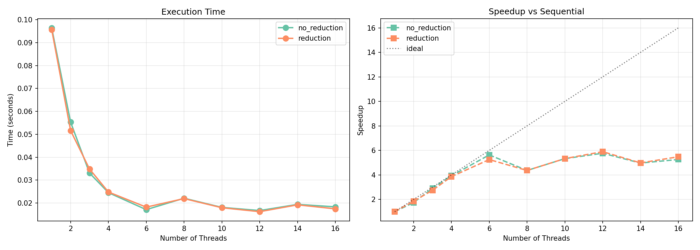
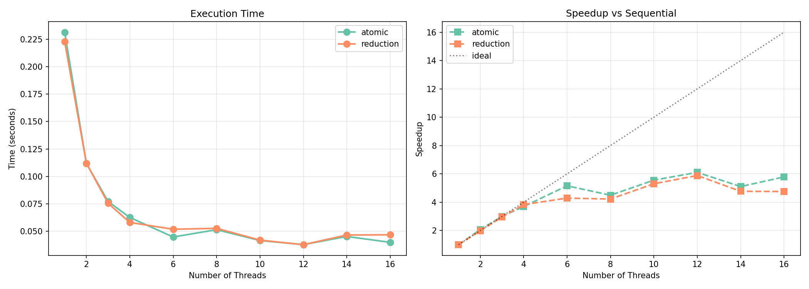
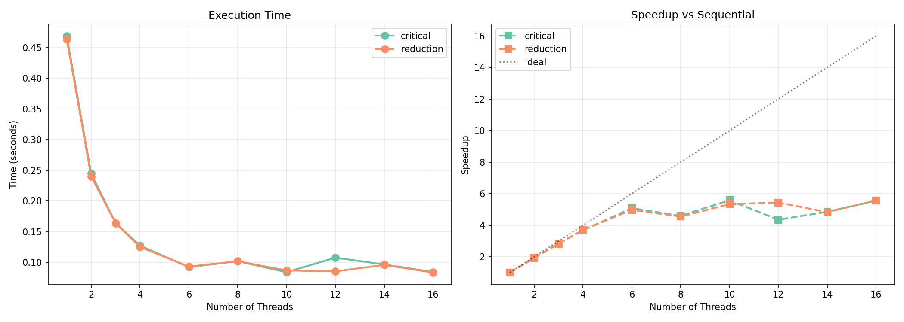
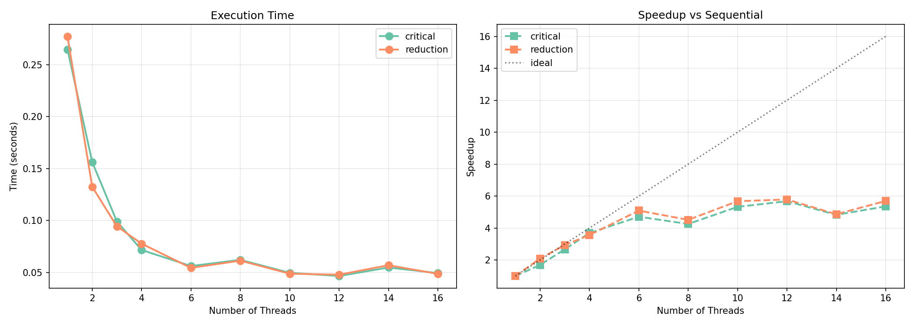
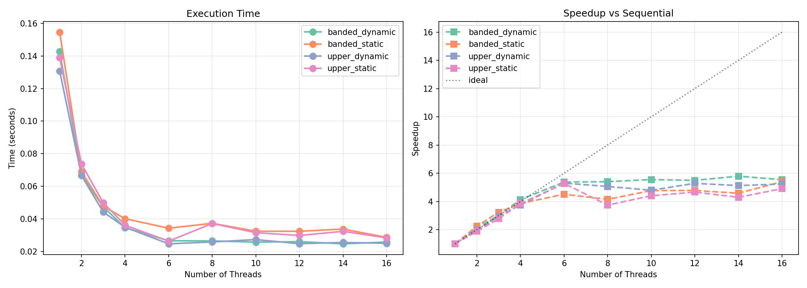
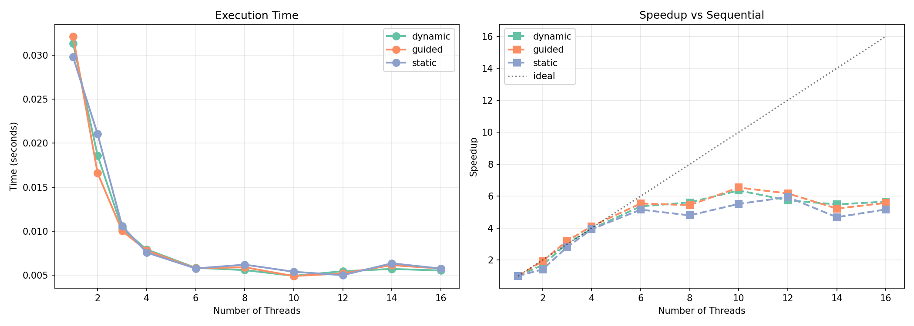
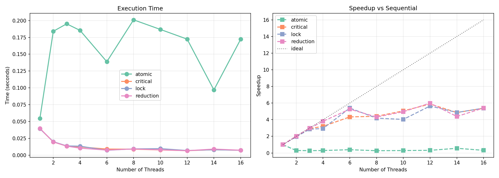
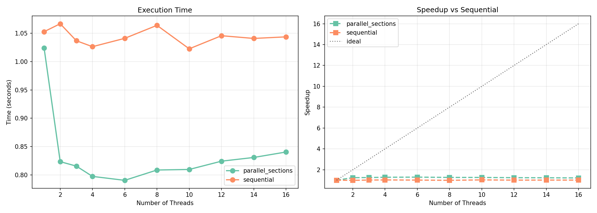
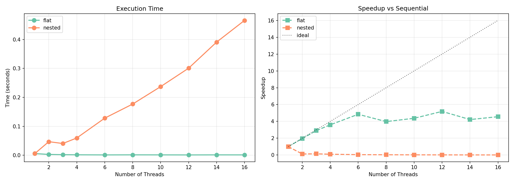

# High Performance Computing. <br>Отчет по лабораторным работам.

[Условия задач](tasks.pdf)  
[Исходный код](src/)  
[Параметры запуска](conf/)  

12 ядер.

---


## 1. Минимальный (максимальный) элемент вектора.

Небольшой локальный скачок около 8 потоков, дальше время снова убывает.  

  

---


## 2. Скалярное произведение двух векторов.

Небольшой локальный скачок около 8 потоков, дальше до 12 время снова убывает.  

`reduction` и `atomic` идут близко друг к другу.  



---


## 3. Определенный интеграл методом прямоугольников.

Небольшой локальный скачок около 8 потоков, дальше до 12 время снова убывает.  



---


## 4. Максимальное значение среди минимальных элементов строк матрицы.

До 6 потоков ускорение существенное, дальше идет почти плато и местами локальные скачки – собенно около 8 потоков.  

Похоже, что полезная работа уже хорошо распараллелена, добавление потоков перестаёт сильно помогать.  



---


## 5. Предыдущая задача с матрицами специального типа.

Почти все графики убывают. У `static` есть локальные скачки, особенно около 8 потоков.  

Задача распараллеливается нормально, но статическое разбиение работы местами ведёт себя менее удачно.  
Похоже на особенности распределения нагрузки и памяти.  

  

---


## 6. Исследовать режимы: static, dynamic, guided.

Небольшой локальный скачок около 8 потоков, дальше до 12 время снова убывает.  



---


## 7. Редукция: critical, atomic, lock, reduction.

Синхронизация в случае `atomic`: много потоков часто обращаются к общей переменной, из-за этого происходит борьба между потоками, создается очередь. Не ошибка.  



---


## ! 8. Скалярное произведение набора векторов (sections).

```
Разработайте программу для вычисления скалярного произведения для последовательного набора векторов (исходные данные можно подготовить заранее в отдельном файле).
Ввод векторов и вычисление их произведения следует организовать как две раздельные задачи, для распараллеливания которых используйте директиву sections. 
```

`sequential` почти не меняется – нормально для последовательного режима.  

`parallel_sections` после 6 потоков перестаёт улучшаться.  
Похоже на ограничения `sections`. Независимых больших кусков работы тут мало, поэтому лишним потокам почти нечего делать.



---


## ! 9. Вложенный параллелизм.

```
Уточните, поддерживает ли используемый Вами компилятор вложенные параллельные 
фрагменты.
При наличии такой поддержки разработайте программу с использованием и без использования вложенного параллелизма (достаточно разработать программу для одной из задач, например, задачи 4) с использованием распараллеливания циклов разного уровня вложенности.
Выполните вычислительные эксперименты и оцените эффективность разных подходов.
```

`flat` ведет себя прилично.  

В методе `nested` проблема в подходе к распараллеливанию.  
Вложенный параллелизм создаёт слишком много накладных расходов, и процессор расходует время не на полезную работу, а на организацию новых команд потоков.  


